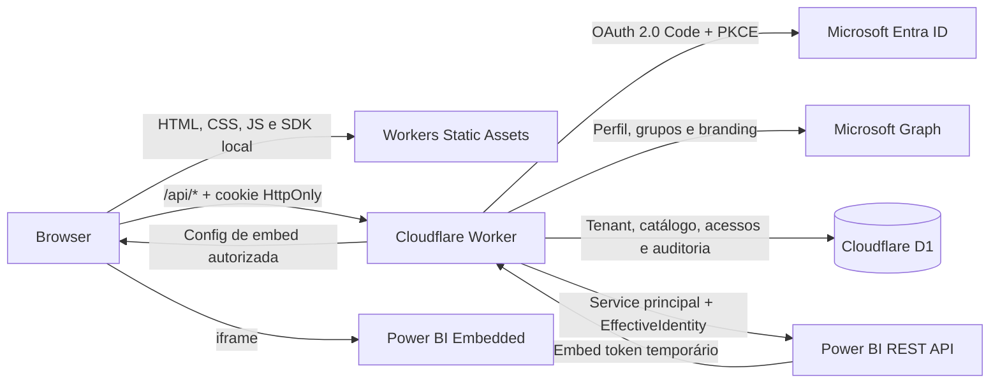

# ShipBI

> **Enterprise White-Label BI Portal — Zero-Framework Vanilla JS, Cloudflare Workers & Entra ID**


ShipBI é um boilerplate comercial para publicar portais corporativos de Power BI Embedded com identidade visual, catálogo, acesso por usuário ou grupo, RLS dinâmico e auditoria por tenant. Cada cliente é configurado no D1; não é necessário criar um fork do frontend para trocar marca, cores ou catálogo.

## O que o produto entrega

- Catálogo responsivo de relatórios por área, busca e destaques.
- Power BI Embedded em modelo app-owns-data com tokens emitidos no backend.
- Microsoft Entra ID via Authorization Code Flow com PKCE e sessão `HttpOnly`.
- Microsoft Graph para grupos transitivos, busca de usuários/grupos e branding organizacional.
- Controle de acesso por usuário ou grupo, múltiplos papéis RLS e diagnósticos de bypass.
- Gestão de relatórios, áreas, confidencialidade, status e acessos no próprio portal.
- Histórico de auditoria com ator, ação, alvo, correlação e snapshots antes/depois.
- White-label por tenant com logos, paleta, modo claro/escuro e CSS opcional.
- SDKs e fontes servidos localmente; nenhum CDN é necessário em runtime.

## Por que esta stack

**Zero framework overhead.** HTML semântico, CSS moderno e JavaScript ES Modules reduzem o tamanho, o tempo de inicialização, o churn de frameworks e a superfície de dependências.

**Segurança corporativa.** PKCE protege o authorization code; o segredo e os tokens de aplicação permanecem no Worker; sessões são opacas, `HttpOnly` e persistidas apenas por hash.

**Governança real.** Toda consulta de catálogo, regra de acesso e auditoria inclui `tenant_id`. O `EffectiveIdentity` entregue ao Power BI combina o UPN autenticado com papéis RLS autorizados no D1.

**Serverless na edge.** Workers, Static Assets e D1 formam uma operação simples, elástica e com custo inicial baixo. Custos de capacidade/licenciamento do Power BI continuam separados.

## Arquitetura



O browser nunca recebe o segredo do App Registration nem o access token do service principal. Veja [docs/ARCHITECTURE.md](docs/ARCHITECTURE.md) e [docs/MICROSOFT_SETUP.md](docs/MICROSOFT_SETUP.md).

## Início local em 5 minutos

Pré-requisitos: Node.js 20+ e `npm`.

```powershell
npm install
Copy-Item .dev.vars.example .dev.vars
npm run setup
npm run dev
```

Abra `http://localhost:8787`. O tenant inicial é `empresa-alfa`; a autenticação de desenvolvimento permite entrar sem Microsoft Entra. Para visualizar o segundo tema, envie `x-tenant: empresa-beta` nas chamadas locais ou altere `DEFAULT_TENANT_SLUG` no `wrangler.toml`.

Validação:

```powershell
npm run check
npm test
```

## Configurar Microsoft Entra e Power BI

1. Copie `.dev.vars.example` para `.dev.vars` e substitua apenas os placeholders.
2. Siga [docs/MICROSOFT_SETUP.md](docs/MICROSOFT_SETUP.md) para registrar o app, consentir permissões e habilitar o service principal.
3. Grave `entra_tenant_id` e `entra_client_id` no tenant desejado, ou defina os fallbacks no ambiente.
4. Cadastre relatórios pela área administrativa; IDs de workspace, relatório e semantic model ficam associados ao `tenant_id`.

## Novo tenant sem alterar código

```sql
INSERT INTO tenants(
  id, slug, name, entra_tenant_id, entra_client_id,
  primary_color, accent_color, theme_json
) VALUES (
  'customer-id', 'customer-slug', 'Customer Name',
  'YOUR_TENANT_ID', 'YOUR_CLIENT_ID',
  '#17365D', '#2F6FA7',
  '{"productName":"Customer Analytics","logoText":"CA","accent":"#17365D"}'
);
```

Logos podem ser enviados pelo editor de identidade visual e são persistidos em `tenant_brand_assets`. Relatórios, áreas, regras e auditoria herdam o tenant da sessão; nunca aceite um `tenant_id` vindo do corpo da requisição.

## Deploy em produção

Crie o banco e copie o `database_id` retornado para `wrangler.toml`:

```powershell
npx wrangler d1 create shipbi-production
npx wrangler d1 migrations apply DB --remote
npx wrangler d1 execute DB --remote --file=seed.sql
```

O seed é demonstrativo; em produção, remova os tenants fictícios ou substitua-os pelos clientes licenciados. Configure segredos e publique:

```powershell
npx wrangler secret put ENTRA_CLIENT_SECRET
npx wrangler secret put SESSION_SECRET
npm run deploy
```

Antes do deploy, defina `APP_ENV = "production"`, `DEV_AUTH_ENABLED = "false"`, a URL pública em `APP_BASE_URL` e o slug padrão correto. Use ambientes Wrangler separados para clientes que exigem isolamento físico de banco e segredo.

## Troubleshooting enterprise

**`AADSTS50011` no login.** A Redirect URI precisa ser idêntica a `APP_BASE_URL/api/auth/callback` e cadastrada como plataforma **Web**. Este projeto troca o code no Worker, não no browser.

**Graph retorna 403.** Confirme o tipo da permissão, o admin consent e se o service principal está autorizado a consultar outro usuário. `User.Read.All` é o menor privilégio de aplicação para a associação transitiva usada pelo backend.

**Power BI retorna 401/403.** Habilite `Embed content in apps` e `Allow service principals to use Power BI APIs`; adicione o service principal ou seu security group como Member/Admin do workspace.

**Embed token falha com RLS.** Confirme semantic model, nome exato do papel e `EffectiveIdentity`. Com service principal, modelos Cloud RLS exigem identidade efetiva.

**CORS local.** O browser chama somente o Worker na mesma origem. Não chame Graph ou Power BI diretamente no frontend; ajuste `APP_BASE_URL` para a origem usada no navegador.

**Token expirado.** Embed tokens são temporários e limitados pelo token Entra usado para gerá-los. Solicite nova configuração de embed no backend antes da expiração.

## Estrutura

```text
src/                 Worker, autenticação, Microsoft Graph e API de BI
site/                portal e dependências estáticas locais
migrations/          evolução versionada do schema D1
seed.sql              dois tenants e dados fictícios de demonstração
tests/                PKCE, RLS, auditoria, isolamento e payloads
docs/                 arquitetura, integração e operação
wrangler.toml         bindings, assets e configuração de referência
.dev.vars.example     template seguro de variáveis locais
```

## Licenciamento comercial

Copyright © 2026. Todos os direitos reservados ao titular deste produto. O código do ShipBI é fornecido sob licença comercial privada: compra, acesso ou posse não concedem direito de revenda, redistribuição, sublicenciamento ou publicação do código-fonte, salvo autorização contratual expressa. Dependências de terceiros mantêm suas próprias licenças; o SDK `powerbi-client` e Material Symbols incluem avisos locais em `site/vendor/`.

Defina no contrato de venda o número de tenants/implantações, suporte, atualizações, SLA, responsabilidade por licenças Microsoft/Cloudflare e tratamento de dados. Este texto é um aviso técnico e deve ser revisado por assessoria jurídica antes da comercialização.
